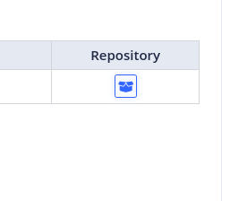

# Repositories configuration Config

On the main page of the [project](https://aquarium-app.redpesk.bzh/#/pages/projects/my-prjs/tux-evse_713f6bdf/overview), you can find a button (Add repository on target)



Clic on it, a pop-up will give you a token and a command line looking like that.

```bash
TOKEN=""

curl -fsSL "https://aquarium-app.redpesk.bzh/kbuild/repos/tux-evse_713f6bdf--redpesk-lts-arz-1.1-update-build/latest/install_repo.sh?token=${TOKEN}" | bash
```

Copy past the command line into a bash session of your board.

Now the repository of the project has been add to your redpesk os.
